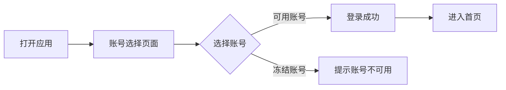
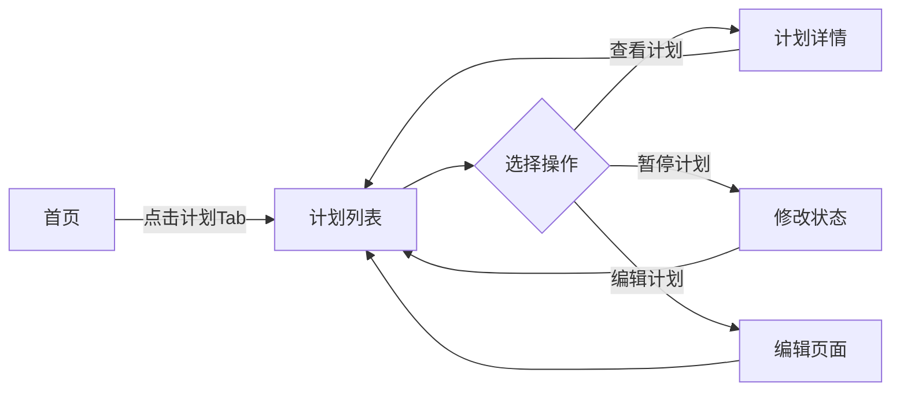
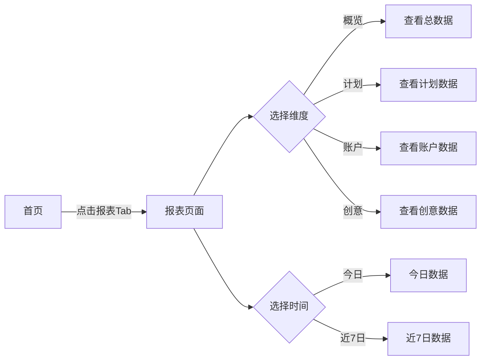
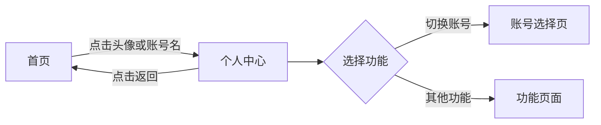

# vivo营销平台 - PRD产品需求文档

## 1. 产品概述
vivo营销平台是一款移动端广告投放管理工具，为广告主提供一站式的多账号管理、投放计划创建、数据报表分析等功能。
- 目标用户：广告投放运营人员、企业营销管理者
- 产品价值：简化广告投放操作流程，提升广告投放效率，通过数据洞察优化投放效果

## 2. 核心功能

### 2.1 用户角色
| 角色 | 核心权限 |
|------|----------|
| 经营主体管理员 | 管理企业主体信息，查看多账号数据 |
| 多账户管理员 | 管理多个投放账号，汇总查看数据 |
| 投放账号 | 操作单个账号的投放计划、数据报表 |

### 2.2 功能模块
1. **账号选择页**：多账号分组展示、账号状态标识、账号切换
2. **首页**：数据概览、数据趋势、快速进入个人中心
3. **账户管理/推广管理页**：根据账号类型动态调整，投放账号显示推广管理（计划列表），其他显示账户管理（多账户列表）
4. **智能诊断页**：预警信息、系统通知、诊断详情展开/收起
5. **数据报表页**：多维度数据展示、时间筛选、图表可视化
6. **计划详情页**：计划详细信息、转化数据、数据趋势
7. **个人中心**：个人信息、账号切换、功能设置

### 2.3 页面详情
| 页面名称 | 模块名称 | 功能描述 |
|---------|---------|---------|
| 账号选择页 | 账号分组展示 | 按经营主体、多账户集合、投放账号分组展示 |
| 账号选择页 | 账号状态标识 | 显示账号可用/冻结状态 |
| 首页 | 数据概览 | 展示花费、曝光、点击、点击率等核心指标 |
| 首页 | 数据趋势 | 展示数据趋势图表 |
| 首页 | 个人中心入口 | 点击头像或账号名进入个人中心 |
| 账户管理/推广管理页 | 动态内容切换 | 根据账号类型显示计划列表或账户列表 |
| 账户管理/推广管理页 | 计划列表 | （投放账号）展示所有投放计划，包含核心数据 |
| 账户管理/推广管理页 | 状态筛选 | （投放账号）全部/投放中/已暂停/已结束筛选 |
| 账户管理/推广管理页 | 账户列表 | （非投放账号）展示子账户列表和今日花费 |
| 智能诊断页 | 预警信息 | 展示投放异常预警，如CTR下降、消耗异常等 |
| 智能诊断页 | 系统通知 | 展示新功能上线、安全提醒等通知 |
| 智能诊断页 | 诊断详情 | 点击诊断项可展开查看详细数据和优化建议 |
| 数据报表页 | 数据维度切换 | 概览/计划/账户/创意四个维度切换 |
| 数据报表页 | 时间筛选 | 今日/近7日/近30日/自定义时间选择 |
| 数据报表页 | 图表展示 | 消耗趋势、转化效果等图表可视化 |
| 计划详情页 | 基本信息 | 展示计划名称、状态、预算、投放时间 |
| 计划详情页 | 转化数据 | 激活数、激活成本、次留数等 |

## 3. 核心流程

### 3.1 用户登录流程

### 3.2 投放计划管理流程

### 3.3 数据分析流程

### 3.4 个人中心流程

## 4. 用户界面设计

### 4.1 设计风格
- 主色调：蓝色 (#0F62FE)，代表专业、可靠
- 辅助色：白色背景、浅灰分隔线、极简边框
- 按钮风格：线性边框按钮、实心主按钮
- 字体：系统默认无衬线字体，清晰易读
- 布局风格：卡片式布局、线性简约风格
- 图标风格：极简线性图标、统一视觉语言

### 4.2 页面设计概览
| 页面名称 | 模块名称 | UI元素 |
|---------|---------|--------|
| 账号选择页 | 账号卡片 | 线性图标、账号信息、状态标签、箭头指示 |
| 首页 | 头像和账号 | 圆形头像、账号名称、账号标签 |
| 首页 | 数据概览 | 四列网格布局、数值醒目、标签清晰、趋势指示 |
| 首页 | 数据趋势 | 趋势图表占位 |
| 数据报表页 | 顶部Tab | 概览/计划/账户/创意、下划线选中状态 |
| 数据报表页 | 图表区域 | 灰色背景占位、图表图标提示 |
| 计划管理页 | 计划卡片 | 状态标签、数据指标、操作按钮 |
| 个人中心 | 菜单列表 | 图标+文字、线性分隔、箭头指示 |

### 4.3 响应式设计
- 移动端优先设计，适配主流移动设备尺寸
- 支持触摸操作，优化点击区域大小（≥44px）
- 底部导航栏固定，适配安全区域
- 页面内容自适应，无横向滚动

## 5. 交互规范

### 5.1 页面切换
- 点击底部Tab切换主页面（首页/账户管理/推广管理/智能诊断/报表）
- 点击页面内按钮跳转详情页
- 详情页点击左上角返回
- 点击首页头像或账号名进入个人中心
- 页面切换带淡入淡出过渡动画
- 底部Tab数量为4个，顺序固定：首页、账户管理/推广管理、智能诊断、报表

### 5.2 账号类型动态适配
- 投放账号登录时，第二个Tab显示为"推广管理"，内容为计划列表
- 经营主体或多账户管理账号登录时，第二个Tab显示为"账户管理"，内容为账户列表
- 切换账号时自动更新Tab名称和页面内容

### 5.3 按钮交互
- 可点击元素有明确的视觉反馈
- 悬停/点击状态有颜色变化
- 主要操作使用实心蓝色按钮
- 次要操作使用边框按钮

### 5.4 数据更新
- 时间筛选切换后数据实时刷新
- 状态筛选切换后列表立即更新
- 图表区域支持交互（预留接口）

## 6. 功能交互详细说明

### 6.1 账号选择页交互
- **账号切换**：点击账号卡片，若账号可用则直接登录并跳转至首页，若账号冻结则提示"账号已冻结，无法登录"
- **账号分组**：按经营主体、多账户集合、投放账号进行分类展示
- **状态标识**：
  - 绿色边框"可用"状态：可正常登录使用
  - 灰色背景"冻结"状态：不可登录

### 6.2 首页交互
- **个人中心入口**：点击顶部头像或账号名进入个人中心
- **数据概览**：展示今日花费、曝光、点击、点击率，并显示同比变化趋势
- **数据趋势**：展示数据趋势图表
- **底部导航**：Tab栏支持切换至首页/账户管理/推广管理/智能诊断/报表页面

### 6.3 账户管理/推广管理页交互
- **动态内容**：根据登录账号类型自动调整显示内容
  - 投放账号：显示推广管理，内容为计划列表
  - 非投放账号：显示账户管理，内容为子账户列表
- **计划列表（推广管理）**：
  - 状态筛选：顶部Tab支持全部/投放中/已暂停/已结束筛选
  - 计划卡片：点击卡片区域跳转至计划详情页
  - 操作按钮：暂停/启动、编辑、复制、重启
- **账户列表（账户管理）**：
  - 显示子账户列表和今日花费
  - 点击账户可查看详情

### 6.4 数据报表页交互
- **维度切换**：顶部Tab支持概览/计划/账户/创意四个维度
- **时间筛选**：支持今日/近7日/近30日/自定义时间选择
- **数据展示**：展示总花费、总曝光、总点击等核心指标
- **图表区域**：消耗趋势图和转化效果图
- **数据列表**：点击列表项可跳转至计划详情页
- **筛选功能**：右下角筛选按钮打开筛选面板，支持状态和投放类型筛选

### 6.5 智能诊断页交互
- **预警信息**：展示投放异常预警，如CTR下降、消耗异常等，带有不同颜色标识（警告黄色、错误红色、信息蓝色）
- **系统通知**：展示新功能上线、安全提醒等系统通知
- **诊断详情**：点击诊断项可展开/收起详细数据和优化建议，包含数据详情和优化建议两部分
- **底部导航**：Tab栏支持切换至首页/账户管理/推广管理/智能诊断/报表页面

### 6.6 计划详情页交互
- **基础信息**：展示计划名称、投放状态、投放日期、投放时段、预算
- **转化数据**：展示激活数、激活成本、次留数
- **核心指标**：展示近7日的花费、曝光、点击、点击率
- **数据趋势**：展示数据趋势图表

### 6.7 个人中心页交互
- **个人信息**：展示头像、姓名、当前账号
- **功能菜单**：
  - 切换账号：返回账号选择页
  - 财务中心：查看账户余额和充值记录
  - 账户设置：账户相关设置
  - 消息通知：查看系统通知
  - 帮助中心：使用帮助和常见问题
  - 关于我们：产品信息和版本号

## 7. 技术规范

### 7.1 页面结构
- 使用单页面应用(SPA)架构
- 通过CSS类控制页面显示隐藏
- 所有页面在同一个HTML文件中加载

### 7.2 样式规范
- 使用CSS变量统一管理颜色
- 响应式设计，最大宽度480px
- 适配iOS和Android设备
- 支持安全区域适配

### 7.3 动画效果
- 页面切换：淡入淡出效果
- 筛选面板：从底部滑入
- Toast提示：从上往下淡入
- 按钮点击：透明度变化反馈

### 7.4 交互反馈
- 所有可点击元素有明确的视觉反馈
- 操作成功或失败都有Toast提示
- 加载状态有明确的指示器（预留）

## 8. 后续优化方向

### 8.1 功能扩展
- 实时数据刷新
- 计划创建和编辑的完整流程
- 数据导出功能
- 推送通知功能

### 8.2 性能优化
- 图片懒加载
- 列表虚拟滚动
- 数据缓存策略
- 网络请求优化

### 8.3 用户体验优化
- 深色模式支持
- 多语言国际化
- 手势操作支持
- 无障碍访问优化